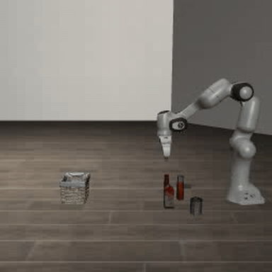
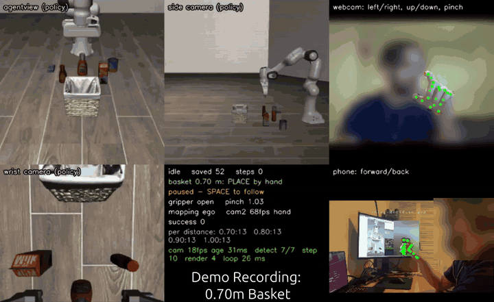
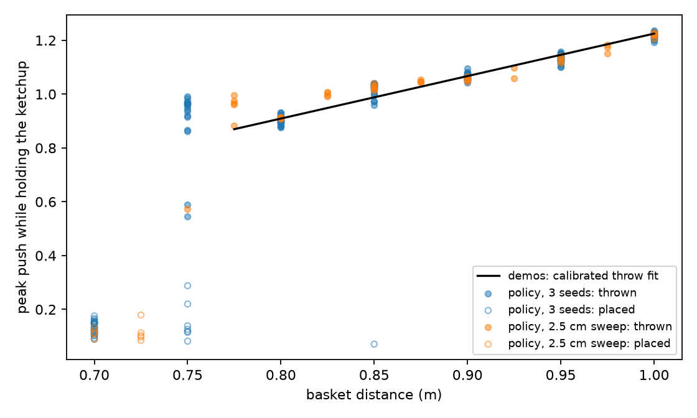
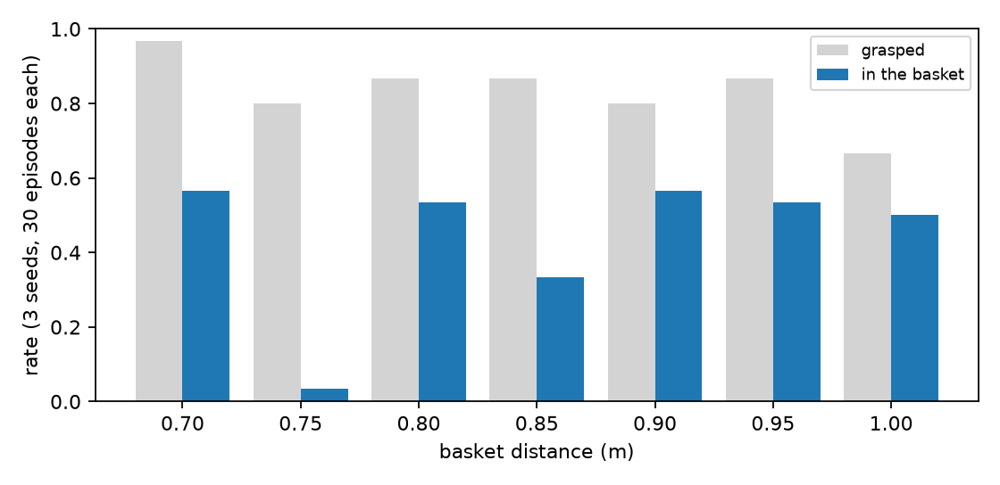
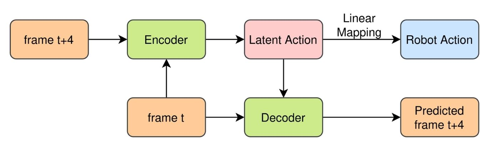
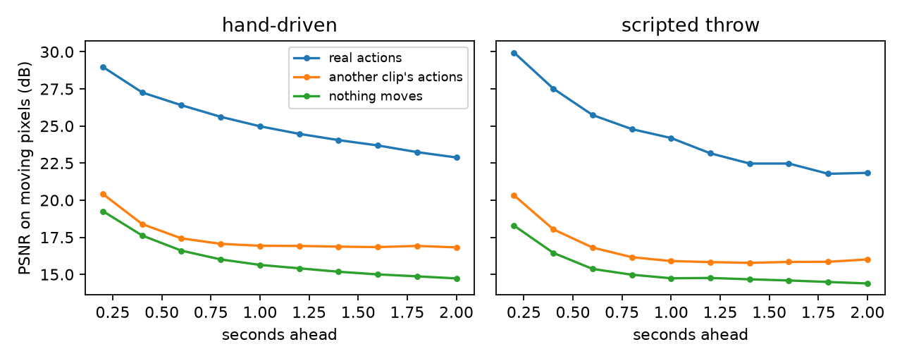
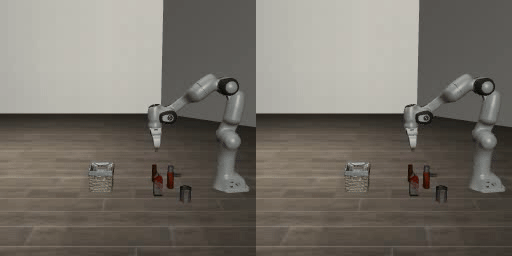
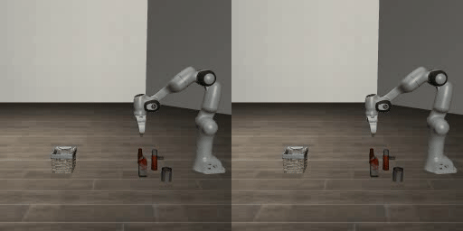

# Hand2Throw

This repo explores the use of fine-tuned SmolVLA for a dynamic throwing task & a built latent action model (LAM) to explore data retrieval from the user videos. Built upon LeRobot, LIBERO and SmolVLA. 

## The Task

<p align="center">
  
</p>

<p align="center"><em>Side camera: the policy throws at 1.00 m, from its cameras alone.</em></p>

An extension of the LIBERO-Object task 4: "pick up the ketchup and place it in the basket". The task explored is putting the ketchup in the basket, but the basket's distance from the robot varies from 0.7m to 1.0m away. The robot needs to switch between placing & throwing based on whether it can reach the basket, and adjust its throw strength based on distance. The clutter in the scene jitters by ±1cm. 

## VLA Fine-Tuning

The SmolVLA used in the original LIBERO tasks (lerobot/smolvla_libero) is further fine-tuned with user collected data on the new task. The fine-tuning only trained the action expert, the vision-language backbone staying frozen. 

### Data Collection

To fine-tune the new task, user data was collected using a mix of teleoperation through hand-tracking and pre-determined motions. For the grip and movement, teleoperation is conducted. Using 2 cameras, the user's hand is tracked in 3D. The distance between the index finger and thumb determines the Franka Panda's grip (binary). Upon a successful grip, the user presses t on their keyboard, which conducts the pre-determined throw motion based on basket placement. This was done as camera low fps & motion blur make tracking at high speeds difficult, meaning webcam teleop is insufficient for highly dynamic actions. The throw demonstrations use privileged strength based on true position of the basket. The policy does not receive this privilege and needs to infer strength and distance from cameras. The throw action exceeds the maximum speed of the joints, and thus this specific throw motion is from simulation testing only. 

An initial 205 demos were recorded, of which 5 are excluded due to bad training data (such as knocking basket over during placement, throwing instead of placing). 

The dataset is available at https://huggingface.co/datasets/erensckin/hand2throw-teleop-demos

<p align="center">
  
</p>

<p align="center"><em>Data collection demonstration for teleoperation and pre-determined trajectory throwing.</em></p>

### Fine-Tune Explorations & Evaluation

The fine-tuning methods and their respective success rates over 210 episodes (70 episodes per seed, 3 seeds) are given. The evaluation tests the baskets at 0.70m, 0.75m, 0.80m, 0.85m, 0.90m, 0.95m and 1.00m, 10 per distance per seed. No training was done for 0.75m, 0.85m or 0.95m, therefore these test the continuous strength inference by the VLA model. Unless stated otherwise, the policy executes all 50 actions of each predicted chunk before planning again.

Differences under about 10 points are within noise: with 210 episodes the standard error is about ±3.4 points, and the seeds of a single model already spread by 6-14 points (main model: 47 / 43 / 41 %, teleop-matched: 53 / 54 / 40 %).


| Method | Description | Grip Success Rate | Throw Success Rate | Success Rate |
|---|---|---|---|---|
| Main model | 200 teleop demos, 20k steps | 83 % | 49 % | 44 % |
| Fewer demos | 100 demos, 20k steps | 83 % | 45 % | 41 % |
| Teleop-matched demos | 56 teleop demos (the scenes kept for the video-inferred set, see Latent Action Model), 10k steps | 88 % | 58 % | 49 % |
| Video-inferred demos | the same 56 scenes, hand actions inferred from hand video (see Latent Action Model), 10k steps  | 33 % | 23 % | 20 % |
| Extra training (control) | main + 5k steps on the same data | 80 % | 42 % | 41 % |
| Self-improvement | main + 5k steps on demos + its own successful rollouts | 65 % | 35 % | 31 % |
| Self-improvement + throw up-weighting | main + 5k steps on demos + its own successful rollouts + throw up-weighting | 40 % | 17 % | 16 % |
| No fine-tuning | pretrained lerobot/smolvla_libero (35 episodes only) | 0 % | 0 % | 0 % |


Models available at https://huggingface.co/erensckin/hand2throw-smolvla

### Execution Time Adaptation Evaluation

SmolVLA's chunks were adapted by executing a given amount of actions before replanning. Async inference emulates a real robot, which keeps moving while the next chunk is computed (about 100 ms on an RTX 5080), so every action is based on a slightly old camera view.


| Method | Description | Grip Success Rate | Throw Success Rate | Success Rate |
|---|---|---|---|---|
| Shorter chunks (25) | main model, 25 actions per chunk | 89 % | 49 % | 50 % |
| Shorter chunks (10) | main model, 10 actions per chunk| 78 % | 46 % | 47 % |
| Re-plan before the throw | main model, chunks of 25, fresh plan right before the throw | 87 % | 52 % | 51 % |
| Short chunks during the throw | main model, chunks of 25, then 10 once the throw starts | 88 % | 50 % | 50 % |
| Async inference, 2-step latency | main model, next chunk computed while the arm moves (100 ms) | 79 % | 34 % | 31 % |
| Async inference, 3-step latency | main model, next chunk computed while the arm moves (150 ms) | 75 % | 35 % | 30 % |
| Random layouts | main model, objects at random positions (70 episodes) | 1 % | 0 % | 0 % |


### Evaluation Analysis

The policy successfully places at 0.70m and throws beyond, and its throw strength matches the demos, including the unseen distances (peak push 1.02 vs 0.99 in the demos at 0.85m, 1.13 vs 1.15 at 0.95m). It infers the basket distance from vision. The model only hesitates at the 0.75m boundary (3% success).

<p align="center">
  
</p>

<p align="center"><em>Peak push while holding the ketchup, per episode. The black line is the calibrated fit that sets the demos' scripted throw. The 0.75m, 0.85m and 0.95m baskets are not seen in training.</em></p>

<p align="center">
  
</p>

| Experiment | Finding |
|---|---|
| Main model | Decent success, but struggles in the throws, mainly because landings scatter ±14cm compared to ±4cm for the privileged scripted thrower used in the demos. |
| 100 demonstrations | Within noise of main: no measurable gain from 100 to 200 demos on this fixed-layout task. |
| Matched demos (teleop & video-inferred) | Video-inferred has considerably less success, and the gap is almost entirely grasping (33% vs 88%). Once it grasps, it succeeds as often (62% vs 56%). More on this in the LAM section. Teleop-matched scored higher than main but within noise; the successful video inference may have acted as a filter for cleaner demos (the kept episodes were 0.25-1s shorter at the throw distances). |
| Extra training | Within noise of main: beyond 20k steps the success rate stays around constant. |
| Self-improvement | Training on the VLA's own successful rollouts made it worse (31% vs 41% for the extra-training control), possibly because some successes were partly luck, and from overfitting to the policy's own behaviour, reducing its ability to recover from unfamiliar states. |
| Self-improvement + throw up-weighting | Worse by far. The throw-only clips take up a bigger share of training, so grasp frames are seen less often and grasping collapses (65% to 40%). The clips may also have broken the continuity between grasp and throw. |
| Shorter chunks | No measurable difference to grasping or throwing. The one clear effect is the place at 0.70m, which rises from 57% to 90% with more frequent re-planning; the throw happens within a single chunk, so re-planning doesn't reach it. |
| Asynchronous inference | Emulates a real robot, where the arm keeps moving while the next chunk is computed. Grip success is within noise, but throw success drops from 49% to 34%: each action is based on a stale view and consecutive plans don't join up, causing small jumps in direction/speed that affect the fast, timing-critical throw the most. The policy was also only trained on synchronous data. |
| Random layouts | 0%. The policy learned where the ketchup sits in the fixed layout, and does not generalise to new object positions. |
| No fine-tuning | 0%. The pretrained LIBERO policy can place the ketchup in its own task, but cannot throw or handle the new action scale. |

Increasing policy performance can be attempted in multiple ways:
- Improve starting data: Obtain throw data with an RL policy instead of a pre-determined one. May reduce training quality, but may also reduce the scatter of throws compared to pre-determined, which had its own lower scatter compared to the VLA.
- Improve throw after training: Use residual RL to correct the VLA's actions during the throw to reduce execution scatter.
- Asynchronous inference improvement: Training the policy on asynchronous inference and attempting real-time chunking is hypothesised to bring the async success closer to that of the sync (main) success.
- Layout diversity: Recording demos with varied object positions, to address the 0% on random layouts.

## Latent Action Model

Training an LAM to use hand video footage to teach a robot what to do. 

### Framework

<p align="center">
  
</p>

We develop a latent action model that is best described by the diagram above. The 9M parameter model is trained over 15k steps, with no action labels. The latent is too small (~28 bits) to carry the image, so it can only carry what changed between the two frames: the action. Frames are 96×96, with *t* and *t+4* being 0.2s apart. One model per video-source. 

1. Action encoder: frames *t* and *t+4* stacked → 4-level CNN → 2-layer MLP → 4 tokens × 3 numbers.
2. FSQ quantiser: 5 levels per number → 125 codes per token (around 28 bits per frame pair).
3. Context encoder: frame *t* → multi-scale features (U-Net).
4. Decoder: U-Net, conditioned on the latent at every decoder scale (FiLM); predicts the change image added to frame t.

A linear map from the latent to robot actions is fitted afterwards, on labelled episodes.

Models available at https://huggingface.co/erensckin/hand2throw-lam/tree/main

Silhouetted hand data available at https://huggingface.co/datasets/erensckin/hand2throw-hand-silhouettes. Remaining data (hand raw, hand masked) available upon request.

### Training

The model was trained on a subset of the teleop data, not using 5-multiple index ids, thus training of 164/205 episodes. Each video-source trained separately. 

### Evaluation

All tests use the episodes not used in training.

#### Do the latents contain the robot's actions?
A linear map from the latent to the robot's action, scored as R² (hand-driven phase; for the hand videos, webcam + phone latents joined and linear map fitted on pair):

| Video | x | z | gripper |
|---|---|---|---|
| Raw (no tracker overlay) | 0.16 | 0.27 | 0.21 |
| Hand-only (rest blacked out using the hand tracker) | 0.69 | 0.67 | 0.59 |
| Silhouette (white hand shape, no pixels) | 0.68 | 0.69 | 0.55 |
| Hand tracker (reference) | 0.69 | 0.67 | 0.87 |
| Robot side camera | 0.20 | 0.23 | 0.20 |
| Robot side camera, untrained encoder (reference) | 0.26 | 0.20 | 0.18 |

The low R² for raw is thought to be due to the noisy video data with monitor movements and body movements in the back. It may also be unable to better follow the hand against the movements of the elbow and rest of the arm. The silhouette may still show good results for the gripper due to the change in the shape of the silhouette. 

The R² value for throws is around 0, thus providing a control. This value was correct for all recordings except the robot side camera (which includes the robot throw) and the raw webcam+phone. This is because the monitor visible in the raw phone footage showed the robot throwing motion, thus presenting a miniature version of the robot side camera. Masking the hand resolved this issue. 

#### Can the decoder imagine ahead?
From one real frame and the real latent actions, the robot-camera model stays accurate for about 2s of slow motion and 1s of the throw. Given another clip's actions it gets clearly worse, so it follows the actions.

<p align="center">
  
</p>

<p align="center"><em>Robot side camera. Higher = imagined frames closer to the real ones, scored only on the pixels that move. "Another clip's actions" starts from the same frame but is given the latent actions of a different recording. "Nothing moves" copies the first frame.</em></p>

The latents encode motion well enough to predict video, but whether they are usable actions depends on video and the amount of motion in the video.

#### Can hand video replace teleop actions? 
Actions inferred from hand video drove 159 re-simulated episodes (the throw is still scripted, started at the logged `t` press). The 56 successes trained SmolVLA to 20%, against 49% for the same 56 scenes with the teleop actions (see the Fine-Tune Explorations & Evaluation table).

<p align="center">
  
</p>
<p align="center"><em>0.80 m. Left: trained on teleop demos. Right: trained on video-inferred demos.</em></p>

<p align="center">
  
</p>
<p align="center"><em>1.00 m. Left: trained on teleop demos. Right: trained on video-inferred demos.</em></p>

Video-inferred demos at https://huggingface.co/datasets/erensckin/hand2throw-video-inferred-demos


Improving the LAM can be attempted in multiple ways:
- Higher-resolution hand crops, to keep the finger detail the grip needs.
- Improve training video quality to limit outside information, e.g. the user wears a coloured glove with a different colour for each finger to allow easier latent motion observation. 
- Adapt the model to train on and take in two videos instead of one, predicting latents from both webcam and phone footage. 

## Run it Yourself

Needs Linux, an NVIDIA GPU (driver ≥ 570), `ffmpeg` and [uv](https://docs.astral.sh/uv/).

### Install

```bash
git clone https://github.com/erensckin/hand2throw && cd hand2throw
uv sync --locked
uv run python -c "import libero.libero"   # first import asks a question: answer N
```

### Evaluate the policy

```bash
uv run hf download erensckin/hand2throw-smolvla --include "main/020000/*" --local-dir ckpt
uv run python scripts/eval_throw.py --policy ckpt/main/020000
```

Runs 10 episodes at each of the 7 distances. Add `--seed 1` or `--seed 2` for the other seeds. Any other model in the table can be evaluated by swapping `main/020000` for its folder in [the model repo](https://huggingface.co/erensckin/hand2throw-smolvla).

### Train

```bash
uv run hf download erensckin/hand2throw-teleop-demos --repo-type dataset --local-dir data/throw_ketchup
LOG=data/throw_ketchup/extra/episodes.jsonl bash scripts/train_throw.sh full
```

20k steps, about 6.4h on a laptop RTX 5080.

### Latent action model

After downloading the teleop demos above:

```bash
uv run hf download erensckin/hand2throw-lam --include "robot_side/*" --local-dir outputs/lam
uv run python scripts/lam.py extract --raw data/throw_ketchup/extra
uv run python scripts/lam_predict.py --sources robot_side --fidelity
uv run python scripts/lam.py probe --sources robot_side
```

The silhouette models can be probed with the published hand silhouettes (white hand shapes on black, no camera pixels):

```bash
uv run hf download erensckin/hand2throw-hand-silhouettes --repo-type dataset --local-dir data/lam_cache
uv run hf download erensckin/hand2throw-lam --include "human_cam*_silhouette/*" --local-dir outputs/lam
uv run python scripts/lam.py probe --sources human_cam1_silhouette,human_cam2_silhouette
```

The other models need my raw webcam and phone recordings. They are available on request.

### Record your own demos

A webcam facing you, and optionally a phone on your left side (DroidCam app, same Wi-Fi as the computer):

```bash
uv run python scripts/teleop.py --no-record --camera2 http://PHONE_IP:4747/video   # practise
uv run python scripts/teleop.py --camera2 http://PHONE_IP:4747/video               # record
```

Press SPACE so the robot follows your hand, pinch to grasp, then release over a close basket or press `t` to throw at a far one. Successful episodes save automatically (`d` discards, `q` quits). Without a phone, leave out `--camera2 ...`. To keep your demos apart from the downloaded ones, add `--root data/my_demos` and train with `ROOT=data/my_demos bash scripts/train_throw.sh full`.